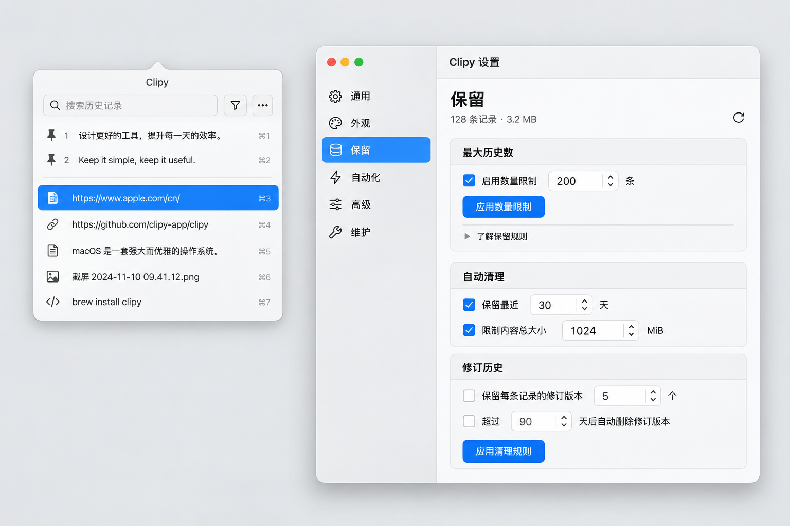

# Clipy 原生界面与文本工作流

2026-09-14，基于用户的两份 UX 提示及本地 Maccy 参考实现。

## 用户与任务

假设核心用户是经常复制文字、链接和文件的 macOS 用户，既包含只想快速
粘贴的新用户，也包含需要重复清理文字的熟练用户。平台仅为 macOS；
响应式设计在这里指可调整的桌面窗口，不增加移动端产品。

主要目标：尽快找回需要的内容，必要时整理文字，然后可靠地粘贴。
常用路径保持「快捷键打开 → 搜索或选择 → 粘贴」。固定项只用原有 pin
标记和一条组间细线区分，不再重复显示“置顶”和“最近”标题。

## 诊断与结构

保留设置的空白主要来自 grouped Form 把开关、字段、应用按钮、说明和
单独的 Divider 分别当作表单行布局，并非中文字符串多了换行。中文
标签与数值控件的自然宽度还可能触发纵向布局，进一步拉大距离。
每个完整设置合成一个紧凑行组，窄宽时仍保留同一个字段及其选择状态。

设置侧栏保留通用、外观、快捷键、保留、自动化、交互、维护。日常操作留在历史
列表；格式详情与解释通过 disclosure 展开。自动化首先呈现内置文本
工作流，现有外部程序连接仍有单独的权限说明。交互设置只暴露实际影响
浏览的行为：会话搜索记忆、经过选择、预览出现等待、移出宽限。

## 屏幕与状态

| 界面 | 入口和主要操作 | 退出与恢复 |
| --- | --- | --- |
| 历史面板 | 快捷键/菜单栏；搜索、选择、粘贴 | Escape 关闭；空结果可清搜索；读取失败可重试 |
| 设置 | 面板或菜单栏；配置一组偏好 | 分类切换保留保留策略草稿；无效值内联说明 |
| 快捷键 | 设置侧栏；点击组合录制、清空或恢复 | 冲突保留旧配置；Escape 取消录制；清空后重启仍停用 |
| 保留 | 设置侧栏；应用数量或清理规则 | 收紧才确认；处理中可取消，失败保留草稿，成功以真实回执为准 |
| 文本编辑 | 条目详情；编辑指定格式 | 保存不可变修订；冲突保留草稿并允许重新加载 |
| 文本工作流 | 编辑器按钮；选择/编排步骤、预览 | 应用到草稿后继续保存修订；取消不改文本，错误调整步骤后重试 |
| 工作流管理 | 自动化设置；保存命名步骤、测试样本文本 | 关闭回到设置；仅保存定义，不保存样本或结果 |

## 交互约定

文字转换必须先展示结果，随后才允许应用到打开时的格式草稿。步骤、
输入变化会使旧预览失效；取消或晚到的计算不能覆盖新结果。最终保存
继续使用编辑器现有 ContentVersion 校验，其他格式仍遵循编辑器的选择。
工作流不启动外部程序、命令或网络，也不自动处理新复制内容。

可保存并重用按顺序执行的步骤，包括首尾空白、大小写、逐行清理、行
去重与排序、字面替换、JSON 美化/压缩。非法 JSON、过大输入、过大输出
和空替换结果提供可恢复反馈。JSON 排版保留数字和字符串词法内容。

保留设置取消只在事务确认回滚后显示取消；在提交后到达的取消不能
把成功改写为“没有变化”。并发修改使旧清理计划失效时明确要求重试。
预览的原生绘制仍只有一个槽位，等待超时后给出可重试结果，避免无限等待。

用户选定的清理模型是先逻辑删除，再分批回收，不增加第二套清理按钮。
原有删除/保留操作提交后立即从列表、搜索、去重和所有新的内容请求中
移除目标；底层脱离 owner 的内容由既有 Authority 清理任务每批回收
最多 32 条表示，批间让出。共享文件最后一个引用消失后才释放；清理
中断由重启继续，不额外推进 History 位置。备份只包含仍保留的内容。
新布局不读取或迁移旧的级联 schema，也不自动删除旧文件。

## 外观与可访问性

默认跟随 macOS，也可选择浅色或深色；AppKit 将选择应用到窗口、sheet
及原生文本控件。使用系统菜单材质、系统选中背景与配套前景、分隔色、
系统字体和 SF Symbols，遵循系统强调色、对比度及透明度偏好。
选中行的匹配文字仍加粗，并使用选中前景，避免强调色文字与背景混在一起。
组间线不进入辅助功能树，固定序号及行操作仍有可读名称。

设置不用颜色独自表示错误；保持控件标签、键盘访问和可见焦点。关闭
鼠标经过选择不改变点击及方向键语义。动态预览计时变更不得重新打开
已经关闭或因内存压力暂停的预览。

保存窗口尺寸与内容拟合分离：真实短内容仍可缩小；拖拽不能将不可操作
的尺寸保存为永久上限。无效旧偏好回退，拖塌则恢复上一可用尺寸。

## 快捷键

全局召唤与面板操作放在独立的“快捷键”页，直接点击当前组合开始录制。
每个可配置操作可清空或恢复默认，也可恢复全部默认；空值明确表示
未分配，不是“缺少偏好所以恢复默认”。全局快捷键清空后依然可以点击
菜单栏图标打开历史。录制期间暂停全局注册，取消录制再恢复原配置，
注册失败保留明确的错误与恢复入口。

面板操作按浏览、选中项目、预览、搜索分组。设置对应现有真实按钮，
主面板、行菜单、预览窗口和 Quick Look 使用同一配置。冲突拒绝新配置，
不会默默抢走另一项操作；非法持久化字段只影响自己的回退。普通文本
输入不会触发裸字母、空格或删除键所绑定的面板动作。

原生文本编辑、方向键、Return 确认/粘贴、Escape 取消/关闭、⌘, 设置和
⌘Q 退出保留 macOS 标准行为，设置页明确列出这一点，不把系统控件
行为伪装成可清空的应用命令。

## 视觉参考

这张图由内置 imagegen 生成，是密度和层次参考，不是产品截图。图中
自动生成的快捷键、修订年龄文字、示例条目和弹窗标题不是新需求；
实现沿用实际保留维度与现有快捷键。应用按钮使用原生按钮风格，不把
所有次要操作都画成蓝色主要按钮。最终仍需 macOS 实机检查深浅色、
中文窄窗、键盘、VoiceOver 以及取消与错误恢复。

生成提示：

> Use case: ui-mockup. Create ONE high fidelity visual target for Clipy, a native macOS clipboard history utility, landscape 1536x1024. Show two actual-size styled native macOS windows on a quiet plain light gray desktop: a small compact clipboard popup at left, and a larger Settings window at right. Native AppKit/SwiftUI appearance, SF system font, crisp Chinese labels, neutral window backgrounds, subtle native menu translucency, system blue used only for selected row and primary button. No decorative gradients, no cards dashboard, no oversized controls. Left popup 360pt wide: search field placeholder 搜索历史记录 with magnifying glass, filter and ellipsis controls; 2 pinned text rows with small pin ordinal, then ONLY a subtle horizontal separator with NO Pinned/Recent labels, 5 ordinary history rows containing useful notes and links; one selected row uses normal macOS blue selection and white text. Main Settings window native traffic lights and sidebar entries 通用, 外观, 保留, 自动化, 高级, 维护; 保留 selected. Detail title 保留. Compact usage line 128 条记录 · 3.2 MB with refresh icon. Group 最大历史数 with checkbox 启用数量限制, numeric field 200 and stepper and 条 in SAME compact logical row; button 应用数量限制 directly below, then collapsed disclosure 了解保留规则. Next group 自动清理 with checkbox 保留最近 30 天 and value in same row, checkbox 限制内容总大小 with 1024 MiB; small subsection 修订历史 with two compact checkbox/value rows; final button 应用清理规则. Natural aligned labels and controls, 8px between related controls, 20px between sections. No large blank rows. Dense but legible, comfortable macOS utility aesthetic, restrained corners and shadows. Image only, no explanatory annotations, no mobile mockup.
